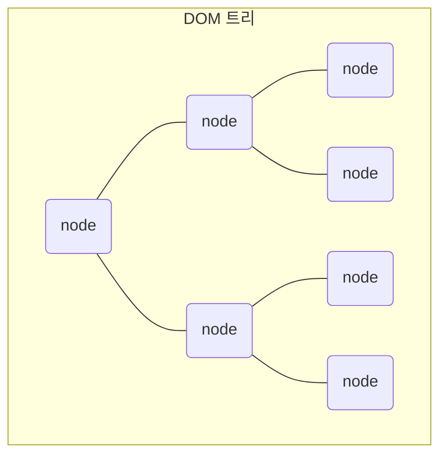
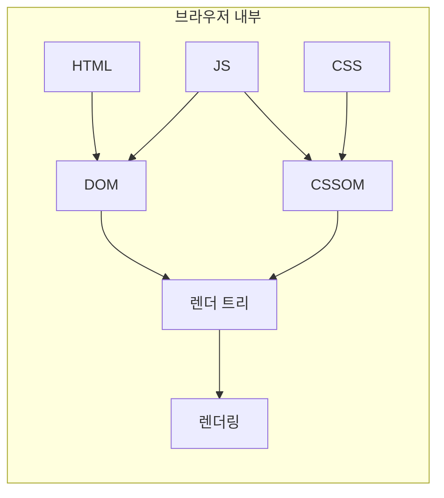
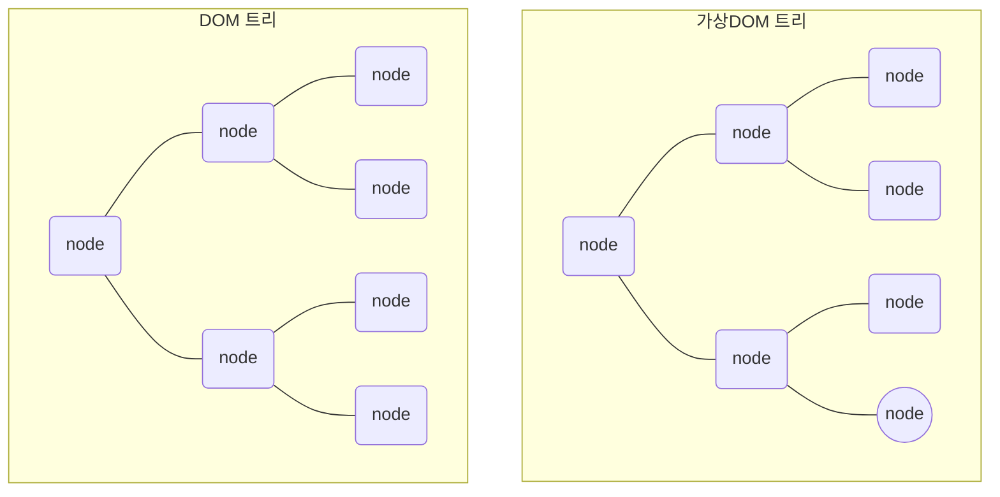
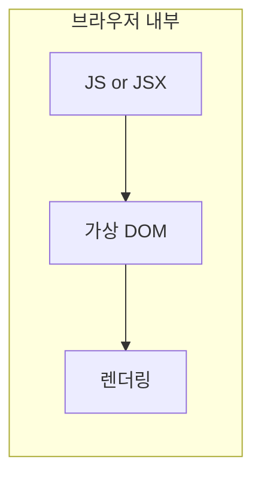

브라우저는 HTML 파일을 분석하여 객체로 구성된 하나의 계층 구조를 그립니다. 각각의 객체들은 **노드**라고 불리며 계층 구조 전체는 **DOM 트리**라고 불립니다. 



CSS 파일도 이와 동일한 과정을 거쳐 **CSSOM 트리**를 만들고 나면 DOM 트리와 CSSOM 트리는 하나로 합해져 **렌더 트리**를 만들어 냅니다. 자바스크립트로 DOM이나 CSSOM을 변경하면 전체 렌더 트리는 처음부터 다시 그려지게 되는데 이 방식은 성능에 부정적인 영향을 줍니다. 그러므로 HTML과 CSS를 사용해 최대한 많은 코드를 작성하고 자바스크립트의 사용은 최소화해야 했습니다.



리액트는 **가상DOM**(virtual DOM)이라는 개념을 사용해 전체 렌더 트리가 다시 그려지는 대신 DOM과 가상DOM을 비교해 변경된 부분만 업데이트할 수 있게 하였습니다. 이로 인해 기존의 DOM이 가진 한계를 극복할 수 있게 되었고 과거에 HTML과 CSS로 작성되던 코드를 자바스크립트로 대체할 수 있게 되었습니다.  



브라우저에서는 HTML과 CSS 파일을 분석할 필요없이 자바스크립트로 직접 작성된 가상DOM 트리를 렌더링합니다.  


요약하자면 작성된 코드가 브라우저에 표시되기 까지의 과정은 다음과 같습니다. 

기존
- DOM과 CSSOM 트리 만들기
- 렌더 트리 만들기
- 렌더링

리액트
- 가상 DOM 트리 만들기
- 렌더링 

# 가상 DOM 트리 생성하기
가상 DOM 트리를 생성한다는 것은 DOM 트리를 구성하는 각각의 노드를 생성한다는 의미이며 우리는 이 노드를 **리액트 엘리먼트**라고 부릅니다. 리액트 엘리먼트를 생성하는 방법은 다음과 같습니다.

- 자바스크립트 사용
- JSX 사용

두 방법 중 어느 것을 택해도 결과는 동일하지만 JSX를 사용하는 것이 조금 더 편리합니다. JSX는 HTML과 유사한 점이 많아 배우기도 어렵지 않으므로 JSX를 사용하시는 것을 추천합니다.(공식 문서에서도 JSX를 추천하고 있습니다.)

## 자바스크립트 사용
```
React.createElement(type, [props], [...children])
```
리액트에서는 엘리먼트를 생성하기 위해 React.createElement()를 사용합니다. 괄호 안에 들어갈 3개의 인자는 태그 이름, 속성, 태그 사이에 들어갈 내용입니다. 

```
React.createElement('p', null, 'Hello world!')
```

여기서는 'Hello world!'라는 문장을 출력하는 p 엘리먼트를 만들어 보았습니다.

보다시피 하나의 엘리먼트를 만드는 일은 그다지 어렵지 않습니다. 하지만 실제 애플리케이션을 개발하게 될 때는 굉장히 많은 엘리먼트가 필요하며 심지어 이들은 서로 중첩되어 있습니다. 

```
React.createElement('div', null,
  React.createElement('p', null, 'Hello world!')
)
```
div 엘리먼트 안에 p 엘리먼트가 중첩되어 있습니다. 위에서 3번째 인자로 문자열이 사용되었던 것과 다르게 여기서는 p 엘리먼트가 사용되었습니다. 

이 코드를 보고 한 가지 알 수 있는 점은 엘리먼트를 하나 생성할 때마다 React.createElement()를 반복해야 한다는 것입니다. 동일한 코드를 무의미하게 반복하는 일은 매우 번거로울 뿐만 아니라 코드의 가독성에도 부정적인 영향을 미칩니다. 그래서 페이스북은 이 문제를 해결하기 위해 여러분에게 JSX라는 도구를 제공합니다.

## JSX 사용
```
<p>Hello world!</p>
```
```
<div>
  <p>Hello world!</p>
</div>
```
앞서 자바스크립트로 작성했던 코드들을 JSX로 다시 작성해보았습니다. HTML과 동일해 보이지만 이것은 HTML이 아닌 JSX로 작성된 코드입니다. JSX에 대한 자세한 설명은 내용이 길어 따로 다룰 예정이며 여기서는 React.createElement()를 사용할 때보다 코드가 훨씬 간결하고 깔끔해졌다는 것과 HTML과 매우 비슷하게 생겼다는 것만 알아두시면 됩니다.


# 가상 DOM 트리 렌더링하기
가상의 DOM 트리를 생성했으니 이제 생성된 DOM 트리를 렌더링할 차례입니다. 
```
ReactDOM.render(element, container[, callback])
```
DOM 트리를 렌더링하기 위해서는 ReactDOM.render()를 사용합니다. 괄호 안에 들어갈 3개의 인자는 리액트 엘리먼트, 생성된 엘리먼트가 들어갈 컨테이너 그리고 콜백 함수입니다.
```
ReactDOM.render(
  React.createElement('p', null, 'Hello world!'),  
  document.getElementById('root')
  );
```
```
ReactDOM.render(
  <p>Hello world!</p>, 
  document.getElementById('root')
);
```
두 가지 방식으로 생성된 리액트 엘리먼트를 렌더링 해보았습니다. 위에서 언급했듯이 리액트를 사용하면 기존에 HTML과 CSS로 작성되던 코드들을 자바스크립트로 대체할 수 있게 되므로 HTML 문서의 body 태그 안에는 root라는 id를 가진 단 하나의 div 태그만이 존재하고 이 태그는 앞으로 작성될 전체 코드를 포함하는 컨테이너가 됩니다. 
