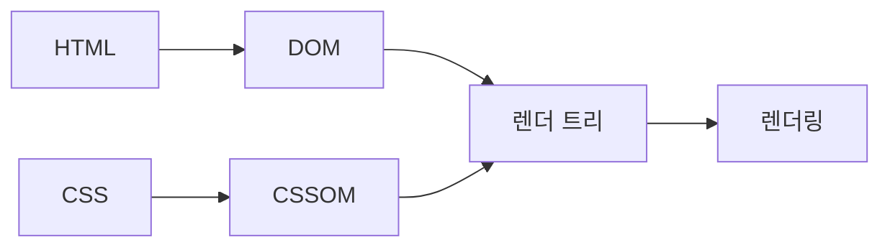
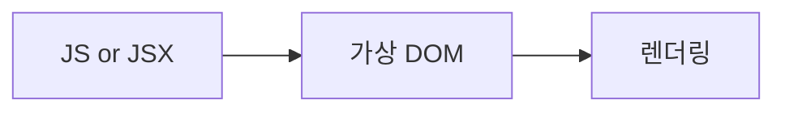
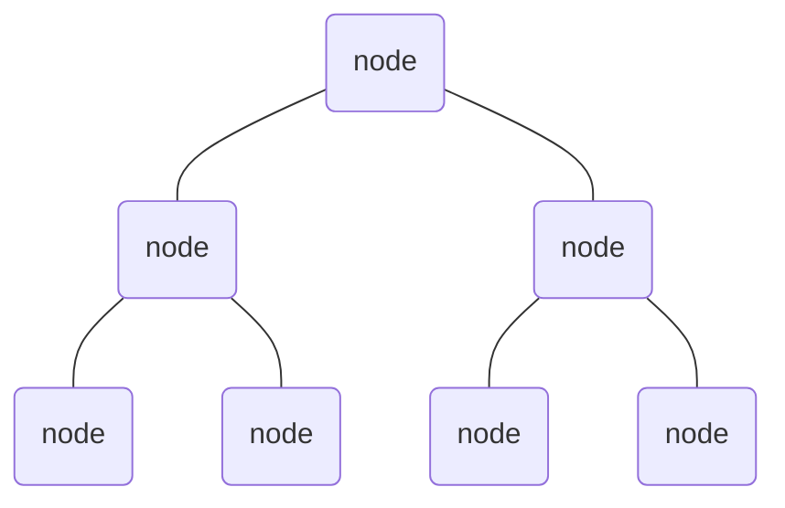

브라우저는 HTML 파일을 분석하여 객체로 구성된 하나의 계층 구조를 그립니다. 각각의 객체들은 **노드**라고 불리며 계층 구조 전체는 **DOM 트리**라고 불립니다. CSS 파일도 비슷한 과정을 거쳐 CSSOM 트리를 만들고 DOM 트리와 CSSOM 트리는 하나로 합해집니다. 하나로 합해진 객체 트리를 렌더 트리라고 합니다. 

작성된 코드가 브라우저에 표시되기 까지의 과정을 간단히 나타내면 다음과 같습니다. 
- DOM과 CSSOM 트리 만들기
- 렌더 트리 만들기
- 렌더링

- 가상 DOM 트리 만들기
- 렌더링 

laksjdlakjsl

